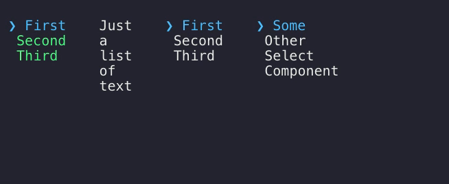

# ink-aligned [](https://travis-ci.org/karaggeorge/ink-aligned) [](https://github.com/sindresorhus/xo)

> Align  Components horizontally for [Ink](https://github.com/vadimdemedes/ink)

Demo
---



Overview
---
Renders the passed children side-by-side. Only affects the first level of children. Width of each child is calculated as the width of its longest line.

Any components can be rendered side-by-side, however if multiple components depend on user input, which one has the focus/receives input is up to the props passed to the children. Components that implement a `focus` prop (like ink-select-input [does](https://github.com/vadimdemedes/ink-select-input#focus)) allow for better control (see example).

Install
---

```
$ npm install ink-aligned
```

Usage
---

```js
const {h, Component, render, Text} = require('ink');
const Aligned = require('ink-aligned');
const SelectInput = require('ink-select-input');

const stdin = process.stdin;

const items = [{
  label: 'First',
  value: 'first'
}, {
  label: 'Second',
  value: 'second'
}, {
  label: 'Third',
  value: 'third'
}];

class Example extends Component {
  constructor(props) {
    super(props);

    this.state = {
      current: 0
    };

    this.handleKeyPress = this.handleKeyPress.bind(this);
  }

  render() {
    const { current } = this.state;

    return (
        <Aligned padding={3}>
          <SelectInput items={items} focus={current == 0}/>
          <SelectInput items={items} focus={current == 1}/>
        </Aligned>
    );
  }

  componentDidMount() {
    stdin.on('keypress', this.handleKeyPress);
  }

  componentWillUnmount() {
    stdin.removeListener('keypress', this.handleKeyPress);
  }

  handleKeyPress(ch, key) {
    const {current} = this.state;

    switch (key.name) {
      case 'right':
      case 'left': {
        this.setState({ current: (current + 1) % 2 });
        break;
      }
      default: break;
    }
  }
}

const unmount = render(<Example />);
```

## Props

### Aligned

#### padding

Type: `number`
Default: `2`

Number of spaces between the aligned components.

Related
---
- [ink-select-input](https://github.com/vadimdemedes/ink-aligned-input) - Alternative Select input component
- [ink-scrollbar](https://github.com/karaggeorge/ink-scrollbar) - Scrollbar component

LICENSE
---

MIT © 2018 [George Karagkiaouris](https://github.com/karaggeorge)
